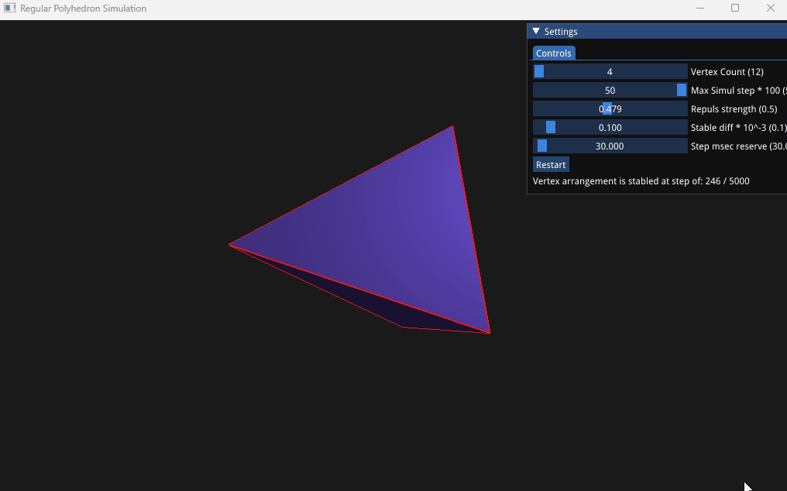

# RegularPolyhedron

## Vertex / Edge / Face number relation
Pyramid has : (V, E, F) = (4, 6, 4)
Then, if 1 Vertex is added over the one of the face, 1 face becomes 3 - 2 faces are increased.
So when Vertex count V >= 4, # of triangle face is : 4 + (V - 4) * 2 = 2V - 4
And, if all the faces are triangle shape, edge count is `# of faces` * 3 / 2 = 3V - 6
So, for the V vertex's polyhedron's (V, E, F) is : (V, 3V - 6, 2V - 4) for V >= 4

## Program
There are only 3 PolyHedron with Triangles when Vertex = 4, 6, 12.  
How will be the shape if Vertex count are not one of these ?

To try PolyHedron with given vertex count, each vertex is initially arranged `r = 1` space randomly.
Then each vertex repulses each other.

## UI menu
1) Vertex Count : It determines PolyHedron's vertex count.  For example, if vertex count is 12, face count is : 12 * 2 - 4 = 20 (Regular PolyHedron)
2) Max Simulation Step : Repulsive power each other is calculated for all vertex then reflected at once step by step.  
   Generally 500 step is enough, but you can limit maximum step limit.  The UI processing will stop after that limit.  
   For the convenience, its unit scale is 100.
3) Repulse Strength : Repulsive power is : factor * (power^2) / (distance^2).  This var is `factor`.  The more vertex, the smaller value better.  If too big value is used with many of vertices it will make fluctuation, then it will not make stable state easily.
4) Stable Diff value : Criterion value that current step causes any move of any vertex.  If none of vertex position is changed as much as `this value`, this program determines that PolyHedron is in stable state, then stop.  
  For convenience, its unit scale is 0.001.
5) Step microsec reserve : Reserved time gap between each frame.  If you want to check with low speed, set bigger value.

You can rotate the object using Up, Down, Left, Right key, and move the view position using 'A', 'D', 'W', 'S', 'X', 'Space' key.

## Reference program
This is a kind of personal OpenGL study after reading great material in https://learnopengl.com/ 
Many of source code is reused (slightly modified) from there.   
For the effective UI object control, I also referred box2d source code.

## Screen Capture

